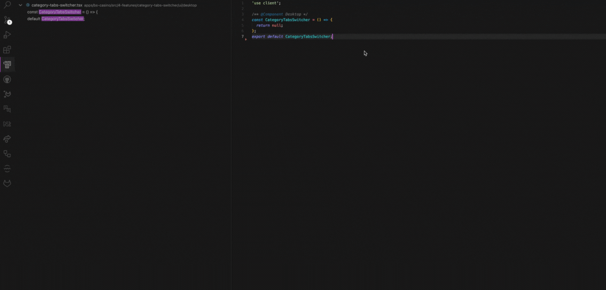

<h1 align="center">
  
  <br/>
  Dynamic Import References
</h1>

<p align="center">
  <strong>Never miss a React lazy or Next.js dynamic import again!</strong><br/>
  Supercharge VS Code's "Find All References" with React.lazy() and Next.js dynamic() detection
</p>

<div align="center" style="margin: 24px 0; padding: 16px;">
  <a href="https://marketplace.visualstudio.com/items?itemName=bubablue00.dynamic-import-references" style="margin: 0 8px 12px 8px; display: inline-block;">
    
  </a>
  <a href="https://marketplace.visualstudio.com/items?itemName=bubablue00.dynamic-import-references" style="margin: 0 8px 12px 8px; display: inline-block;">
    
  </a>
  <a href="LICENSE" style="margin: 0 8px 12px 8px; display: inline-block;">
    
  </a>
  <a href="https://github.com/bubablue/dynamic-import-references/stargazers" style="margin: 0 8px 12px 8px; display: inline-block;">
    
  </a>
</div>

<p align="center">
  
</p>

<div align="center">

### ⚡️ **Level Up Your Stack Instantly**

</div>

<blockquote align="center">
<p>✨ <strong>Essential for teams using code splitting, lazy loading, and modern React patterns</strong> ✨</p>
<p>This extension is your <em>secret weapon</em> for navigating modern React codebases. It bridges the gap between VS Code's static analysis and React's dynamic patterns, ensuring <strong>zero missed references</strong> in your lazy-loaded components.</p>
</blockquote>

<div align="center">

---

</div>

## ✨ Why You'll Love This Extension

<table>
<tr>
<td width="50%">

### 🎯 **Smart React & Next.js Detection**
Automatically finds React lazy and Next.js dynamic imports that VS Code's built-in search misses:
```jsx
// These are now included in "Find All References"!
const LazyComponent = React.lazy(() => import('./MyComponent'));
const DynamicComponent = dynamic(() => import('./MyComponent'));
```

</td>
<td width="50%">

### ⚡ **Zero Configuration**
Just install and go! Works seamlessly with:
- **React** code splitting with `React.lazy()`
- **Next.js** dynamic imports with `dynamic()`
- Any React-based framework using these patterns
- Custom lazy loading implementations

</td>
</tr>
<tr>
<td width="50%">

### 🔧 **Developer Friendly**
- **No performance impact** - only runs when you need it
- **TypeScript aware** - understands your type definitions
- **Path resolution** - handles aliases and relative imports
- **Monorepo ready** - works with complex project structures

</td>
<td width="50%">

### 🎨 **Perfect For React Ecosystems**
Designed specifically for React and Next.js projects:
- ⚛️ **React** with lazy loading
- 🔺 **Next.js** with dynamic imports
- 📱 **React Native** Metro bundler
- 🖼️ **Gatsby** code splitting
- 📦 Any React-based framework

</td>
</tr>
</table>  

## 🚀 Quick Start

<details>
<summary><strong>📦 Installation (Click to expand)</strong></summary>

### Method 1: VS Code Marketplace (Recommended)
1. Open **VS Code**
2. Press `Ctrl+Shift+X` (or `Cmd+Shift+X` on macOS)
3. Search for **"Dynamic Import References"**
4. Click **Install** ✨

### Method 2: Command Line
```bash
code --install-extension bubablue00.dynamic-import-references
```

### Method 3: VSIX File
Download the latest `.vsix` file from [releases](https://github.com/bubablue/dynamic-import-references/releases) and install manually.

</details>

### 🎯 How to Use

1. **Open any React/Next.js file** in your project
2. **Right-click** on a component name that's used in `React.lazy()` or `dynamic()`
3. **Select "Find All References"** (or press `Shift+F12`)
4. **Enjoy complete results** including lazy and dynamic imports! 🎉


> **Pro Tip:** Works especially well with React components that are code-split using `React.lazy()` or Next.js `dynamic()` imports!

## 📋 Supported Patterns & Languages

<div align="center">

| Language | Extensions | Supported Patterns |
|----------|------------|-------------------|
| **JavaScript** | `.js`, `.jsx` | `React.lazy()`, `dynamic()` |
| **TypeScript** | `.ts`, `.tsx` | `React.lazy()`, `dynamic()`, with types |

</div>

### 🔍 Detection Examples

```jsx
// ✅ All of these patterns are detected:

// React lazy loading
const LazyComponent = React.lazy(() => import('./components/LazyComponent'));
const AnotherLazy = lazy(() => import('./components/AnotherComponent'));

// Next.js dynamic imports
const DynamicComponent = dynamic(() => import('./components/Button'));
const ConditionalComponent = dynamic(() => import('./components/Modal'), {
  ssr: false
});

// Variable declarations with lazy/dynamic
let MyLazyComp = React.lazy(() => import('./MyComponent'));
var MyDynamicComp = dynamic(() => import('./MyComponent'));
const MyComponent = lazy(() => import('./path/to/MyComponent'));

// TypeScript with types
const TypedComponent: React.ComponentType = lazy(() => import('./TypedComponent'));
```

### ❌ **Not Supported (Standard ES6 dynamic imports)**
```javascript
// These patterns are NOT detected by this extension:
const module = await import('./module');
import('./module').then(module => {});
const { Component } = await import('./Component');
```

## ⚙️ Configuration

**Zero configuration required!** 🎉 The extension works automatically when enabled.

<details>
<summary><strong>🔧 Advanced Settings (Optional)</strong></summary>

While the extension works out of the box, you can customize its behavior in VS Code settings:

```json
{
  "dynamicImportReferences.enabled": true,
  "dynamicImportReferences.includePatterns": ["**/*.{js,jsx,ts,tsx}"],
  "dynamicImportReferences.excludePatterns": ["**/node_modules/**"]
}
```

</details>

## 🛠️ Development & Contributing

<details>
<summary><strong>🚀 Local Development Setup</strong></summary>

### Prerequisites

<div align="center">

**Node.js 16+**, **npm** and **VS Code 1.60+**

</div>

### Getting Started
```bash
# Clone the repository
git clone https://github.com/bubablue/dynamic-import-references.git
cd dynamic-import-references

# Install dependencies
npm install

# Open in VS Code
code .

# Start development
npm run watch:esbuild
```

### Running Tests
```bash
# Run all tests
npm test

# Run tests in watch mode
npm run watch-tests
```

### Debugging
1. Press `F5` to launch the Extension Development Host
2. Open a test project in the new window
3. Test the extension functionality

### Building for Release
```bash
npm run package
```

</details>

<details>
<summary><strong>🤝 How to Contribute</strong></summary>

We welcome contributions! Here's how you can help:

1. **🐛 Report Bugs** - Found an issue? [Open an issue](https://github.com/bubablue/dynamic-import-references/issues)
2. **💡 Suggest Features** - Have an idea? We'd love to hear it!
3. **📝 Improve Documentation** - Help make the docs even better
4. **🔧 Submit Code** - Fix bugs or add features with a PR

### Contribution Guidelines
- Fork the repository
- Create a feature branch (`git checkout -b feature/amazing-feature`)
- Commit your changes (`git commit -m 'Add amazing feature'`)
- Push to the branch (`git push origin feature/amazing-feature`)
- Open a Pull Request

</details>

<table>
<tr>
<td width="50%">

#### 🎯 **Core Features** 
- 🔍 **React.lazy() detection** - *Fully implemented*
- ⚡ **Next.js dynamic() detection** - *Production ready*
- 📘 **TypeScript support** - *Complete with types*
- 🔗 **Path alias resolution** - *All aliases supported*

</td>
<td width="50%">

#### 🔮 **Future Enhancements**
- 🔥 **Webpack lazy imports** - *Coming soon*
- 📱 **React Native support** - *Under consideration*
- 🎨 **Custom import patterns** - *Planned*
- 🚀 **Performance optimizations** - *Ongoing*

</td>
</tr>
</table>

<div align="center">

**💡 Have an idea?** [Suggest a feature](https://github.com/bubablue/dynamic-import-references/issues/new?template=feature_request.md) • **🐛 Found a bug?** [Report it](https://github.com/bubablue/dynamic-import-references/issues/new?template=bug_report.md)

---

</div>

## 💝 Support

<div align="center">

**Love this extension?** Help us grow! 

[](https://github.com/bubablue/dynamic-import-references)
[](https://marketplace.visualstudio.com/items?itemName=bubablue00.dynamic-import-references)
[](https://twitter.com/intent/tweet?text=Check%20out%20this%20awesome%20VS%20Code%20extension%20for%20dynamic%20imports!&url=https://marketplace.visualstudio.com/items?itemName=bubablue00.dynamic-import-references)

</div>

## 📄 License

This project is licensed under the **MIT License** - see the [LICENSE](LICENSE) file for details.

---

<div align="center">

**Made with ❤️ by developers, for developers**

<sub>Icon by <a href="https://www.freepik.com/icon/search_5459841">Arkinasi</a></sub>

</div>
